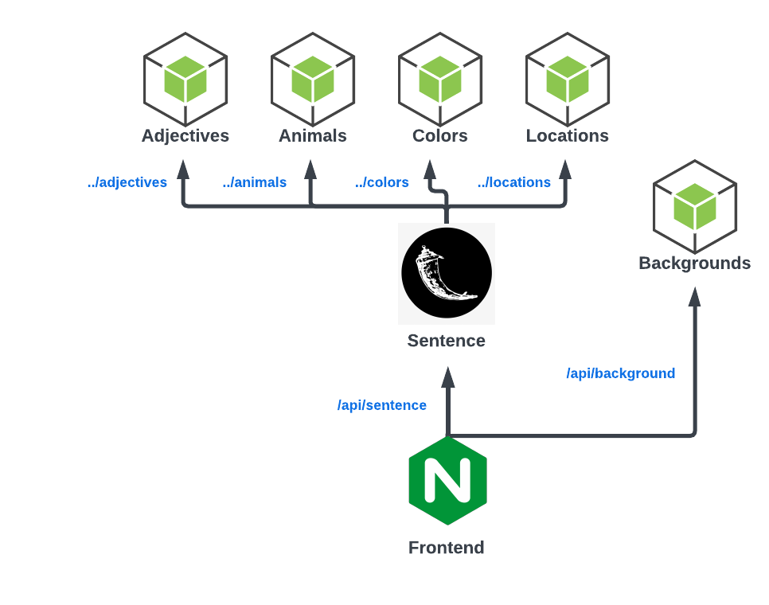

# MS Build Demo
This repo holds all assets for an F5 Distributed Cloud talk for the Microsoft Build conference.

## Talk Abstract
_We will demonstrate the ease of connecting and securing application workloads across Azure, on-premises data centers, and other environments using F5 Distributed Cloud Services. The demonstration will highlight automatic workload service discovery and advertisement, API discovery and schema learning, and the robust application security capabilities of the F5 Distributed Cloud Platform including WAAP, Bot Management, and the API Protection rules engine._  

## API App Overview
Thanks to Anton and Matthieu for the use of the [sentence API app](https://github.com/f5devcentral/sentence-demo-app).
Slight modifications have been made to the app to make this demo. 

The app includes a [web frontend](./api-containers/frontend/) and a small number of simple microservices. 
The [sentence generator](./api-containers/sentence/) calls secondary microservices to generate a small unique sent containing an [adjective](./api-containers/adjectives), [animals](./api-containers/animals/), [colors](./api-containers/colors/), and [locations](./api-containers/locations/).

### API Service Graph



## Distributed Cloud Infrastructure
F5 Distributed Cloud allows application services to be applied to apps hosted in many different ways -- standard compute, K8s clusters including CSP distros like AKS, or on XC AppStack.
In most cases, an XC nodes simply needs to "discover" the service via DNS, Consul, or via the kube api. 

This demo uses an XC AppStack cluster running in Azure. Deployment of XC Customer Edges [can be performed and automated](https://docs.cloud.f5.com/docs/how-to/site-management) through the F5 Distributed Cloud Console.

### XC Object Punchlist
Here is a complete list of XC objects used in this example:

- [ ] Namespace
- [ ] Virtual Site
- [ ] Virtual K8s
- [ ] Origin Pool
- [ ] Health Check
- [ ] User Identification
- [ ] HTTP Loadbalancer

## Deploy
 <TBD>

```shell
kubectl create secret generic regcred \
    --from-file=.dockerconfigjson=docker-auth.json \
    --type=kubernetes.io/dockerconfigjson
```

## References
